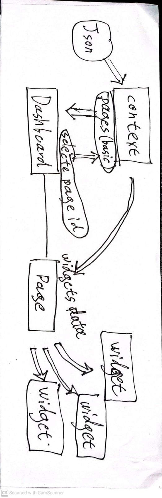

Design: json data set number of pages, number of widget in page, the layout and size, type.
(Note: The data is randomly generated every time, so everything is changing on rerender)
The application state is done in a React context.
For the layout widgets in the page I used css grid - mainly because I wanted to give it a try :)
The look is old-style (for fun) and not very good (for lack of time)
Many things should be changed, improved or added, but I'm out of time. Hope you enjoy, I'd be glad to answer any questions

"yarn start" will get you started
